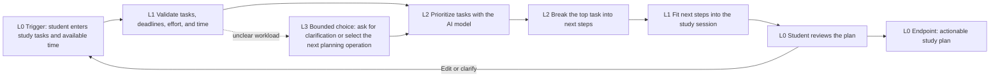

# Study Planner Workflow

```mermaid
flowchart LR
    A[L0 Trigger: student enters study tasks and available time]
    --> B[L1 Validate tasks, deadlines, effort, and time]
    --> C[L2 Prioritize tasks with the AI model]
    --> D[L2 Break the top task into next steps]
    --> E[L1 Fit next steps into the study session]
    --> F[L0 Student reviews the plan]
    --> G[L0 Endpoint: actionable study plan]

    F -->|Edit or clarify| A
    B -. unclear workload .-> H[L3 Bounded choice: ask for clarification or select the next planning operation]
    H --> C
```
